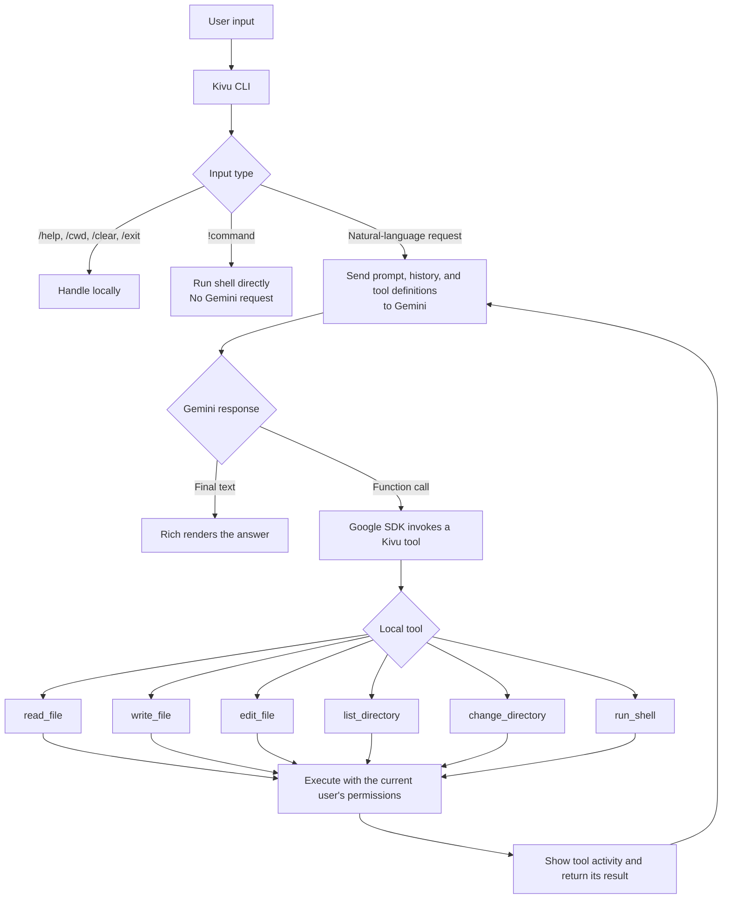

# Kivu

Kivu is a small Gemini-powered terminal agent written in Python. It turns natural-language requests into local filesystem or shell actions, shows each tool it runs, and returns a concise result in the terminal.

Gemini chooses a tool and its arguments; Kivu executes that tool on your computer. The Google Gen AI SDK handles the function-calling loop.

## Features

- Interactive chat and one-shot prompts
- Read, write, and exact-match edit tools for text files
- Directory listing and persistent working-directory changes
- Shell commands for tasks such as `mv`, `cp`, `mkdir`, search, Git, and tests
- Visible tool calls, command results, and risky-command confirmation
- Minimal terminal UI built with Rich

## Requirements

- Python 3.10 or newer
- A [Gemini API key](https://aistudio.google.com/app/apikey)
- Conda, `venv`, or another Python environment manager

## Install from source

Clone the repository and enter the project directory:

```bash
git clone https://github.com/ABHISHEKBARNWAL1301/kivu.git
cd kivu
```

### With Conda

```bash
conda create -n kivu python=3.11 -y
conda activate kivu
python -m pip install -e .
```

### With `venv`

```bash
python3 -m venv .venv
source .venv/bin/activate
python -m pip install -e .
```

`-e` installs Kivu in editable mode and creates the `kivu` terminal command. Changes made to the local source code are used immediately without reinstalling.

Set your API key in the same terminal session:

```bash
export GEMINI_API_KEY="your-api-key"
```

Do not put the real key in source code or commit it to Git.

## Usage

Start an interactive session in the current directory:

```bash
kivu
```

Run one request and exit:

```bash
kivu -p "show me the five largest files in this directory"
```

Choose a starting directory or model:

```bash
kivu --cwd ~/Documents
kivu --model gemini-3.5-flash
```

You can also run the package without the installed command:

```bash
python -m kivu
```

Interactive commands:

| Command | Purpose |
| --- | --- |
| `/cwd PATH` | Change Kivu's persistent working directory |
| `/clear` | Clear the model conversation |
| `/help` | Show available commands |
| `/exit` | Exit Kivu |
| `!COMMAND` | Run a shell command directly without calling Gemini |

Use `kivu --help` to see all CLI options. `--yes` automatically approves commands classified as risky; use it carefully.

## How it works



For a request such as “show me the five largest files,” Gemini will normally select `run_shell`, Kivu will execute one local command, and the result will be sent back to Gemini for the final answer. More complex requests may use several tool rounds.

## Safety

Kivu runs with your operating-system user account and can access the same files and programs that account can. It asks for confirmation before commands matching its risky-command rules, but this is a small safeguard rather than a complete security sandbox. Review displayed commands before approving them.

## Development

Run the tests from the project directory:

```bash
python -m unittest discover -s tests -v
```

The project intentionally keeps the core small: the agent loop lives in `kivu/agent.py`, local tools in `kivu/tools.py`, the terminal UI in `kivu/ui.py`, and CLI handling in `kivu/cli.py`.
